<div align="center">

# Pholio

**Track every position, in one calm place.**

A broker-agnostic portfolio tracker for long-term individual investors. Enter your
transactions once and get live valuations, per-position P&L, sector allocation and a
watchlist — without jumping between three broker apps and a spreadsheet.

[](https://astro.build/)
[](https://react.dev/)
[](https://www.typescriptlang.org/)
[](https://supabase.com/)
[](https://workers.cloudflare.com/)
[](#license)

</div>

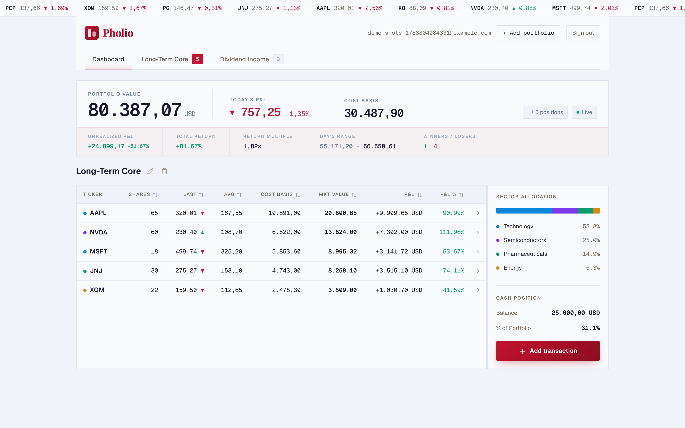

---

**Jump to:** [What you get](#what-you-get) · [Product tour](#product-tour) ·
[Quick start](#quick-start) · [How it works](#how-it-works) ·
[Configuration](#configuration) · [Testing](#testing) · [Deployment](#deployment)

---

## What you get

|                             |                                                                                                                                                           |
| --------------------------- | --------------------------------------------------------------------------------------------------------------------------------------------------------- |
| **Multiple portfolios**     | Split holdings by strategy — "Long-Term Core", "Dividend Income", "Speculative" — each with its own tab, position count and P&L.                          |
| **Real position math**      | Cost basis, market value, unrealized P&L in % and absolute value, total return, return multiple, winners/losers — computed from your lots, not estimated. |
| **Live-ish prices**         | End-of-day quotes from [Finnhub](https://finnhub.io/), cached per day in Postgres. A ticker tape and day-range bars show where each symbol sits today.    |
| **Sector allocation**       | Automatic sector classification per ticker, with a share-of-portfolio breakdown.                                                                          |
| **Cash positions**          | Deposits and withdrawals tracked alongside equities, so "% of portfolio in cash" is honest.                                                               |
| **Watchlist**               | Symbols you don't own yet — price, change, % change, day range, previous close.                                                                           |
| **Lot-level history**       | Every buy is a lot you can inspect, edit or delete; averages recompute immediately.                                                                       |
| **Private by construction** | Per-user isolation enforced in the database (Supabase Row Level Security), not just in the UI.                                                            |

**Status:** MVP. Email/password auth, manual transaction entry, USD-first. No broker
imports, no automated sync, no tax reporting.

## Product tour

<table>
<tr>
<td width="50%">

**Landing page** — the pitch, feature highlights and a three-step "how it works".

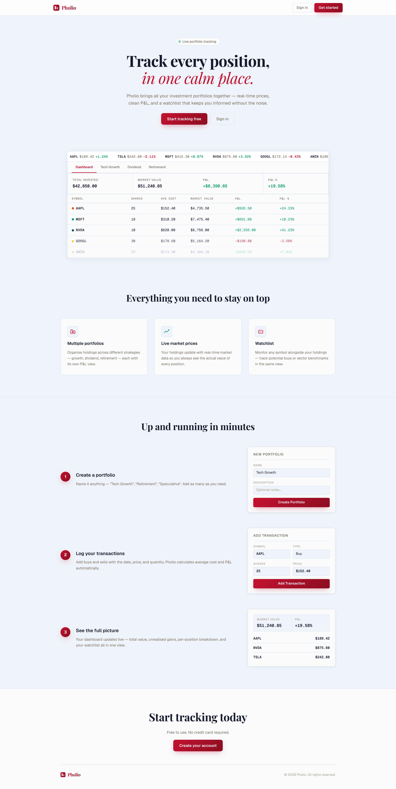

</td>
<td width="50%">

**Sign in / sign up** — email and password, minimum six characters, nothing else to fill in.

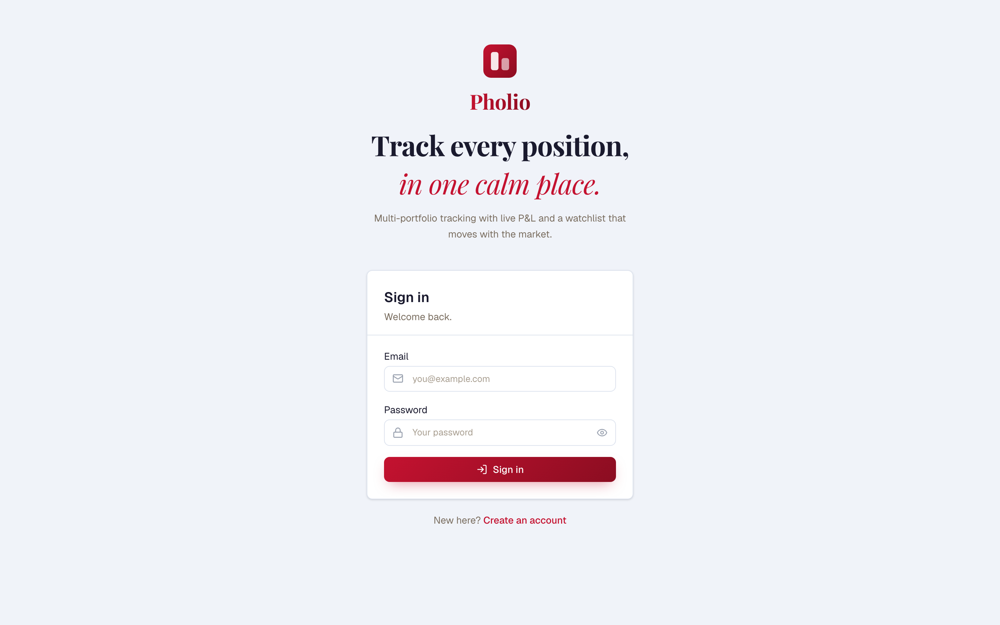

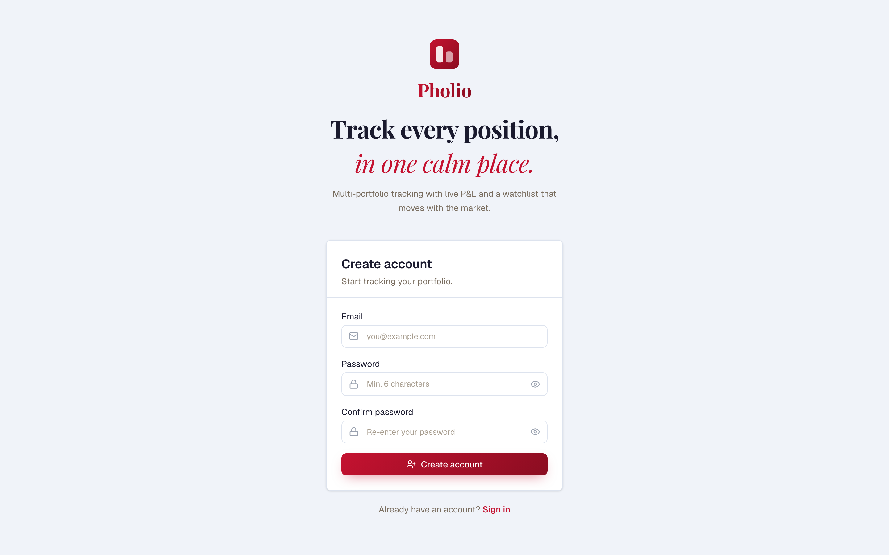

</td>
</tr>
</table>

### First run: empty to first portfolio

| Empty dashboard                                                                                                           | Create a portfolio                                                                                |
| ------------------------------------------------------------------------------------------------------------------------- | ------------------------------------------------------------------------------------------------- |
| 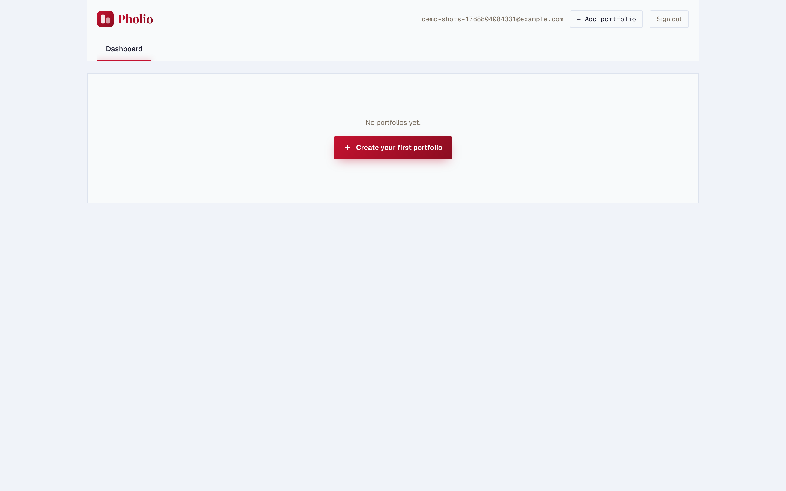 | 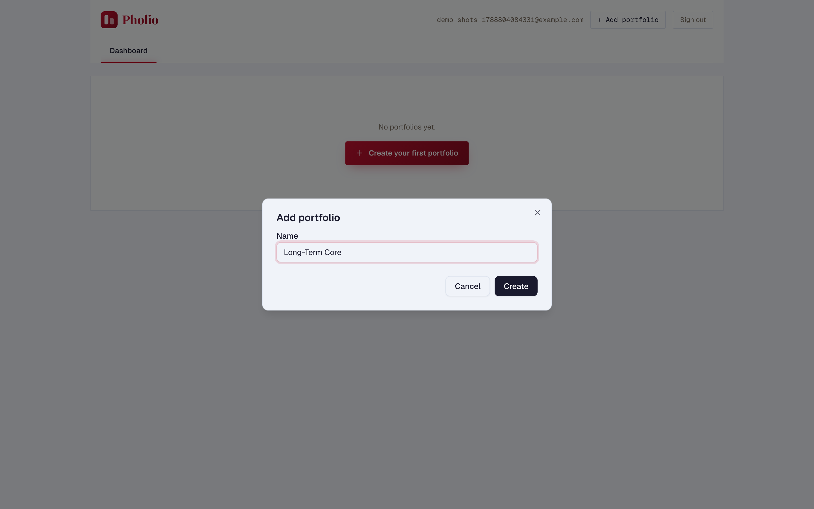 |

A new account starts with a single call to action. Name a portfolio anything you like
and add as many as you need — each one becomes a tab.

### The dashboard

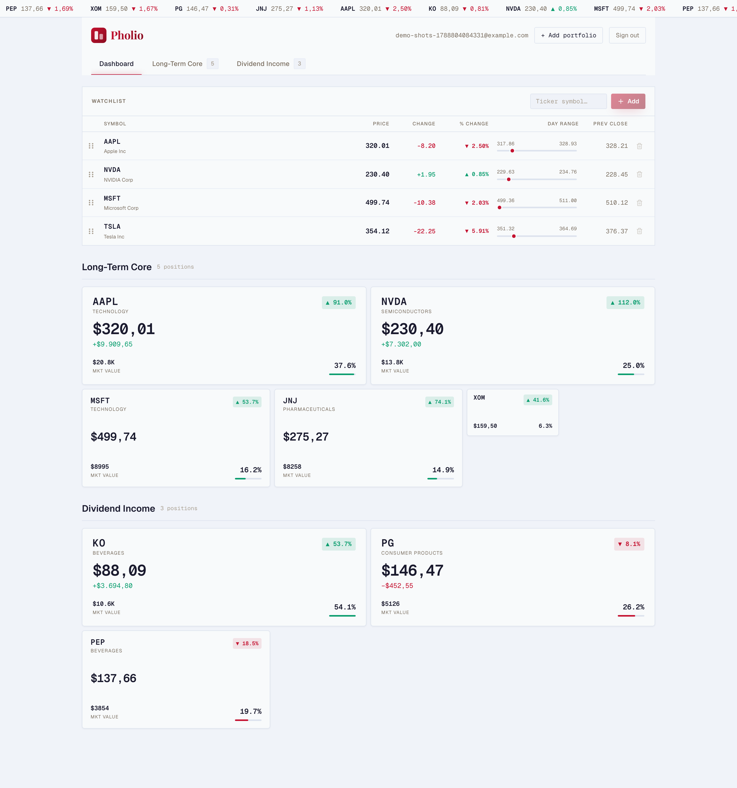

The **Dashboard** tab is the everything-at-once view: a live ticker tape across the top,
your watchlist, then every portfolio as a grid of position cards sized by weight — big
holdings get big cards, so concentration is visible at a glance.

### Watchlist

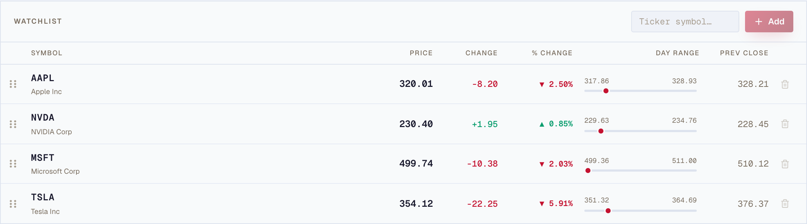

Track symbols you're considering next to the ones you own. Rows are reorderable and show
where the price sits inside today's range.

### Portfolio detail

| Summary bar                                                                                                                                                                  | Sector allocation & cash                                                                                    |
| ---------------------------------------------------------------------------------------------------------------------------------------------------------------------------- | ----------------------------------------------------------------------------------------------------------- |
| 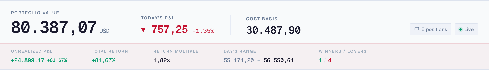 | 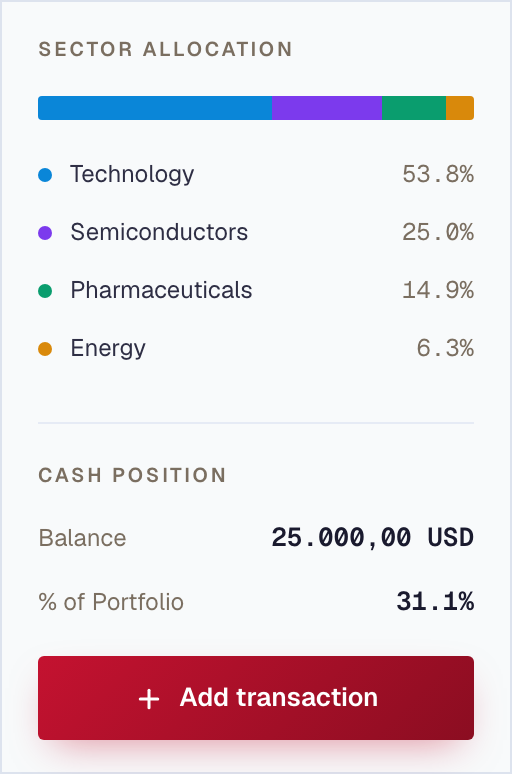 |

Selecting a portfolio tab gives you the summary bar, a sortable positions table
(ticker, shares, last, average cost, cost basis, market value, P&L, P&L %), the sector
split and your cash balance as a percentage of the portfolio.

### Adding transactions

| Stock purchase                                                                                                                                                 | Cash deposit or withdrawal                                                                                                                               |
| -------------------------------------------------------------------------------------------------------------------------------------------------------------- | -------------------------------------------------------------------------------------------------------------------------------------------------------- |
| 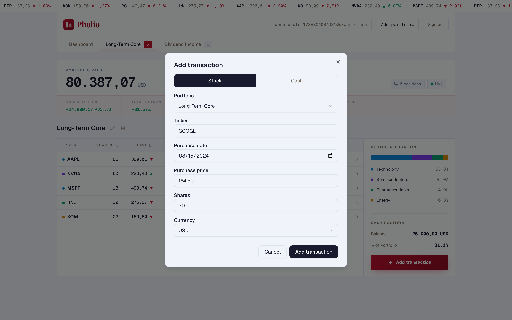 | 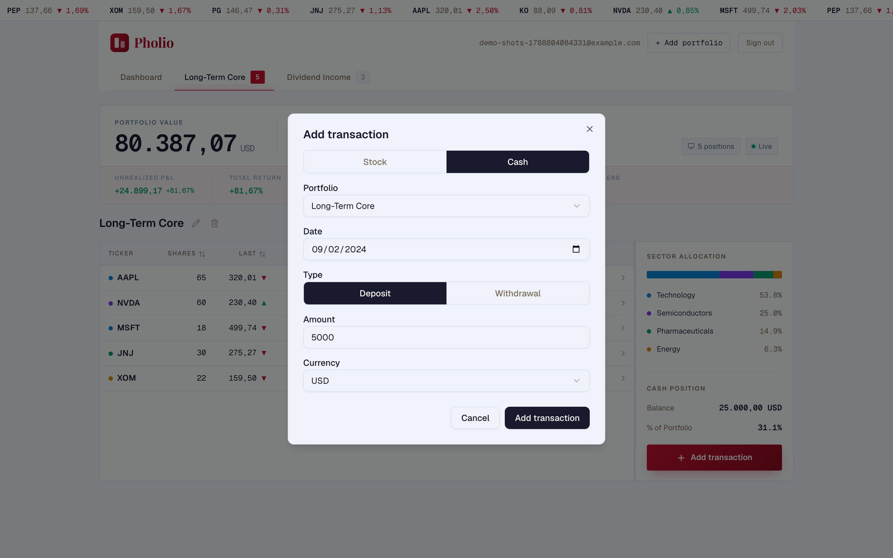 |

One dialog, two modes. Stock entries create a lot; cash entries move the balance. Both
pick their target portfolio explicitly, so you can log from anywhere in the app.

### Editing history

| Lots for a position                                                                                                          | Deleting a lot                                                                                                              |
| ---------------------------------------------------------------------------------------------------------------------------- | --------------------------------------------------------------------------------------------------------------------------- |
| 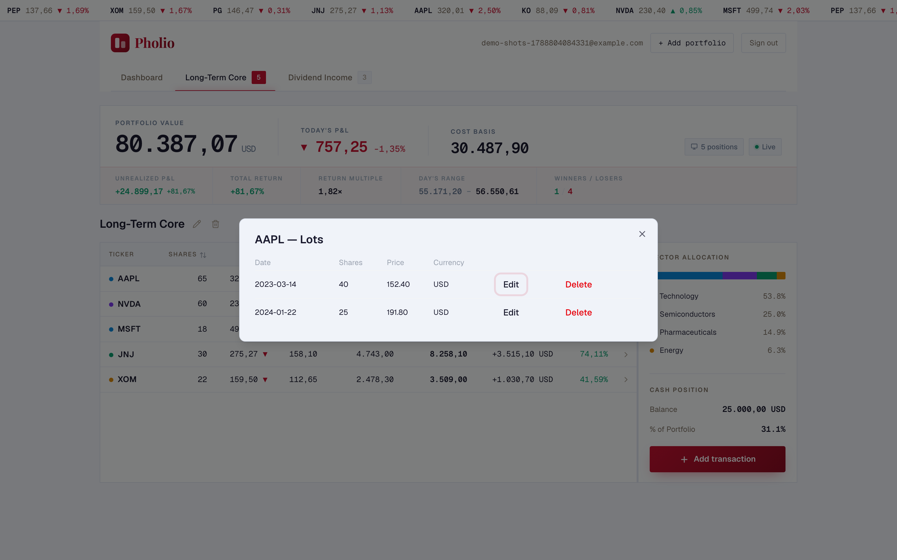 | 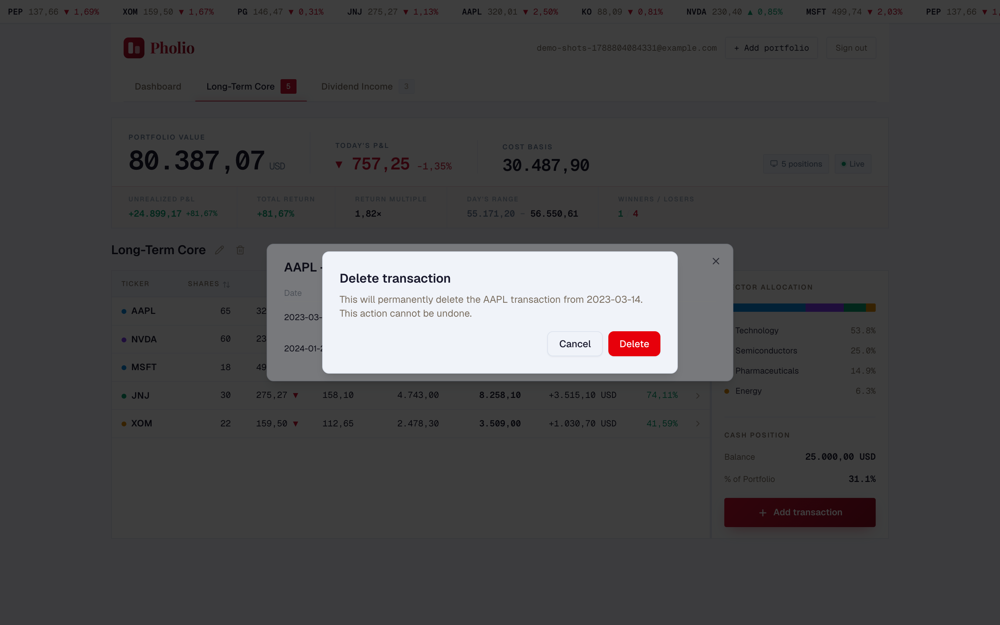 |

Expand any position to see the individual lots behind its average cost. Destructive
actions are confirmed and name exactly what will disappear.

## Quick start

**Prerequisites:** Node.js v22.14.0 (see `.nvmrc`), [Docker](https://www.docker.com/)
with ~7 GB RAM for local Supabase, and a free
[Finnhub API key](https://finnhub.io/register).

```bash
git clone <repo-url>
cd pholio
npm install

# 1. Start the local database + auth stack (downloads images on first run)
npx supabase start
npx supabase db reset          # apply migrations

# 2. Configure secrets — see Configuration below
$EDITOR .env                   # paste the anon key printed by `supabase start`
cp .env .dev.vars              # Cloudflare local dev reads .dev.vars

# 3. Run it
npm run dev
```

The app is at `http://localhost:4321`; local Supabase Studio at
`http://localhost:54323`. Create an account at `/auth/signup` and you're on the
empty dashboard shown above.

Stop the stack with `npx supabase stop` when you're done.

## How it works

```
Browser ── Astro SSR (Cloudflare Workers)
              │
              ├── src/middleware.ts ......... session + PROTECTED_ROUTES guard
              ├── /api/portfolios ........... portfolio CRUD
              ├── /api/transactions ......... equity + cash CRUD
              ├── /api/watchlist/quotes ..... quotes for up to 25 tickers
              │
              ├── Supabase Postgres ......... transactions, portfolios, prices,
              │                               sectors — all behind RLS
              └── Finnhub ................... quotes + company profiles
```

- **Rendering.** Astro renders pages server-side; React islands (`src/components/`)
  handle the interactive dashboard, forms and charts.
- **Prices.** `src/lib/prices.ts` reads the `prices` table first and only calls Finnhub
  for tickers not already fetched today, with concurrency capped via `p-limit`. If
  Finnhub is unavailable the last stored price is used rather than failing the page —
  and if there is no stored price, the UI says so instead of crashing.
- **Sectors.** `src/lib/sectors.ts` caches company profiles the same way, so the
  allocation chart costs no extra API budget.
- **Portfolio math.** `src/lib/portfolio.ts` is pure and unit-tested — lots in,
  positions and P&L out.
- **Isolation.** Every user-data table has Row Level Security policies; anonymous grants
  are revoked in migrations. Integration tests assert cross-user reads and IDOR writes
  both fail.

### Project structure

```
src/
├── components/
│   ├── auth/           # Sign-in / sign-up forms
│   ├── portfolio/      # Position cards, summary, watchlist, sector chart
│   ├── transactions/   # Dashboard view, add-transaction form, lots modal
│   └── ui/             # shadcn/Radix primitives
├── lib/                # Portfolio math, prices, sectors, Finnhub, Supabase, schemas
├── pages/
│   ├── api/            # auth, portfolios, transactions, watchlist
│   ├── auth/           # sign-in, sign-up, confirm-email
│   ├── dashboard.astro # Protected dashboard
│   └── index.astro     # Landing page
├── test/integration/   # RLS, IDOR, unauthenticated-API, smoke
├── types/
└── middleware.ts       # Route protection
tests/e2e/              # Playwright specs + auth fixture
supabase/migrations/    # Schema, RLS policies, grants
wrangler.jsonc          # Cloudflare Workers config
```

## Configuration

Create `.env` at the project root (and copy it to `.dev.vars` for Wrangler):

| Variable          | Description                                                              |
| ----------------- | ------------------------------------------------------------------------ |
| `SUPABASE_URL`    | Supabase project URL (local: `http://127.0.0.1:54321`)                   |
| `SUPABASE_KEY`    | Supabase `anon` public key                                               |
| `FINNHUB_API_KEY` | Finnhub API key — free tier at [finnhub.io](https://finnhub.io/register) |

```
SUPABASE_URL=http://127.0.0.1:54321
SUPABASE_KEY=<anon key>
FINNHUB_API_KEY=<finnhub key>
```

These are declared as **server-only secrets** via Astro's `astro:env` schema — they are
never shipped to the client.

### Using a hosted Supabase project

```bash
npx supabase link --project-ref <project-ref>
npx supabase db push
```

Then point `SUPABASE_URL` at `https://<project-ref>.supabase.co` and use the anon key
from **Settings → API**.

### Routes

| Route                 | Description                                                     |
| --------------------- | --------------------------------------------------------------- |
| `/`                   | Landing page                                                    |
| `/auth/signin`        | Email/password sign-in                                          |
| `/auth/signup`        | Email/password sign-up                                          |
| `/auth/confirm-email` | Post-signup "check your inbox" page                             |
| `/dashboard`          | Protected dashboard (redirects to sign-in if not authenticated) |

Protection is configured in `src/middleware.ts` — add paths to `PROTECTED_ROUTES` to
require authentication.

## Scripts

| Command                     | What it does                                |
| --------------------------- | ------------------------------------------- |
| `npm run dev`               | Development server                          |
| `npm run build`             | Production build                            |
| `npm run preview`           | Preview the production build                |
| `npm run typecheck`         | TypeScript / Astro type check               |
| `npm run lint` / `lint:fix` | ESLint with type-checked rules              |
| `npm run format`            | Prettier                                    |
| `npm test` / `test:watch`   | Unit tests (Vitest)                         |
| `npm run test:integration`  | Integration tests — requires local Supabase |
| `npx playwright test`       | End-to-end tests — requires local Supabase  |

## Testing

Three layers, each with a different job:

- **Unit** (`npm test`) — portfolio math, Finnhub client, the dashboard load-error path.
  Pure functions, no I/O.
- **Integration** (`npm run test:integration`) — runs against a real local Supabase and
  proves the security guarantees: RLS blocks cross-user reads, IDOR writes are rejected,
  unauthenticated API calls get 401.
- **End-to-end** (`npx playwright test`) — Playwright drives the real app on port `4610`.
  A `setup` project signs in once via the API and stores the session, so specs start
  authenticated. Specs cover the seeded happy path plus the Finnhub fallback,
  no-data and dashboard-load-error cases.

E2E and integration runs both read `.env.test`, which should point at your local
`supabase start` instance — never at a production project.

> Writing new E2E tests? Use `getByRole` / `getByLabel` / `getByText`, never CSS or XPath;
> never `page.waitForTimeout()` — wait on state instead. See `CLAUDE.md` and the
> `/10x-e2e` workflow.

## Deployment

Deploys to [Cloudflare Workers](https://workers.cloudflare.com/):

```bash
npm run build
npx wrangler deploy
```

Set the secrets in the Cloudflare dashboard or via CLI:

```bash
npx wrangler secret put SUPABASE_URL
npx wrangler secret put SUPABASE_KEY
npx wrangler secret put FINNHUB_API_KEY
```

### CI

GitHub Actions runs on every push and PR to `main`:

- **unit** — lint, typecheck, build and unit tests
- **integration** — boots Supabase in the runner, applies migrations, runs the
  integration suite

Configure `SUPABASE_URL`, `SUPABASE_KEY` and `FINNHUB_API_KEY` as repository secrets for
the build step. Deployment runs after a successful CI workflow.

## License

MIT
